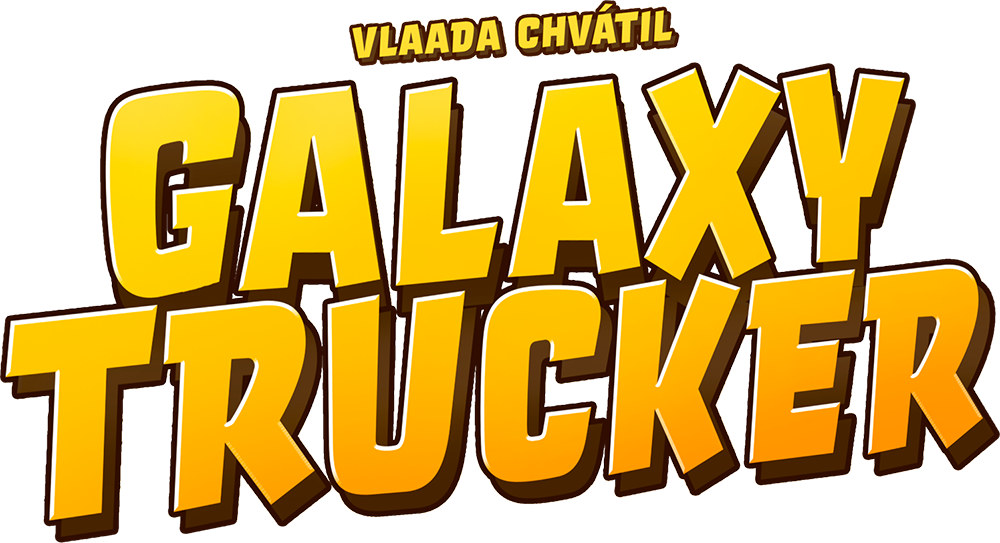

# Galaxy Trucker - Software Engineering Project - Academic Year 2024 - 2025  
Galaxy Trucker is the Java implementation of the omonimus board game by Cranio Creations. It is the final project of the Software Engineering course of Computer Science Engineering held at Politecnico di Milano.

*Professor*: Gianpaolo Saverio Cugola

*Group ID*: GC26

## The Team
* [Samuele Segrini](https://github.com/samuelesegrini)
* [Manuela Terribile](https://github.com/manuelater)
* [Alessandra Varricchio](https://github.com/alessandravarricchio)
* [Diego Zanca](https://github.com/diego-zanca)

## The Project  

This project is a Java-based software adaptation of the board game Galaxy Trucker, developed as the final project for the Software Engineering course. It features a distributed client-server architecture and follows the Model-View-Controller design pattern.  

 

Game rules: [here](https://github.com/samuelesegrini/ing-sw-2025-segrini-terribile-varricchio-zanca/blob/main/documentation/rules-requirements/galaxy-trucker-rules-en.pdf);

Project requirements: [here](https://github.com/samuelesegrini/ing-sw-2025-segrini-terribile-varricchio-zanca/blob/main/documentation/rules-requirements/requirements.pdf);

## Implemented Features 

### Game-Specific Requirements
* Faithful reproduction of the physical board game
* Automatic validation of ship construction
* Real-time visibility of all players' ships
* Full ruleset implemented

### Main functionalities
| Functionality                    | Status |
|:---------------------------------|:------:|
| Complete rules                   |   ✅    |
| RMI                              |   ✅    |
| Socket                           |   ✅    |
| TUI _(Textual User Interface)_   |   ✅    |
| GUI _(Graphical User Interface)_ |   ✅    |

### Advanced functionalities
| Functionality                | Status |
|:-----------------------------|:------:|
| Test Flight                  |   ✅    |
| Simultaneous games           |   ✅    |

✅ Implemented  

