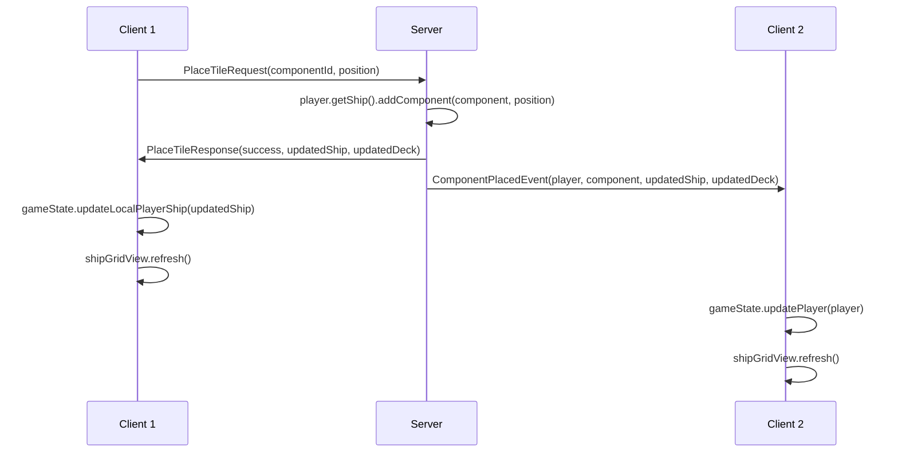
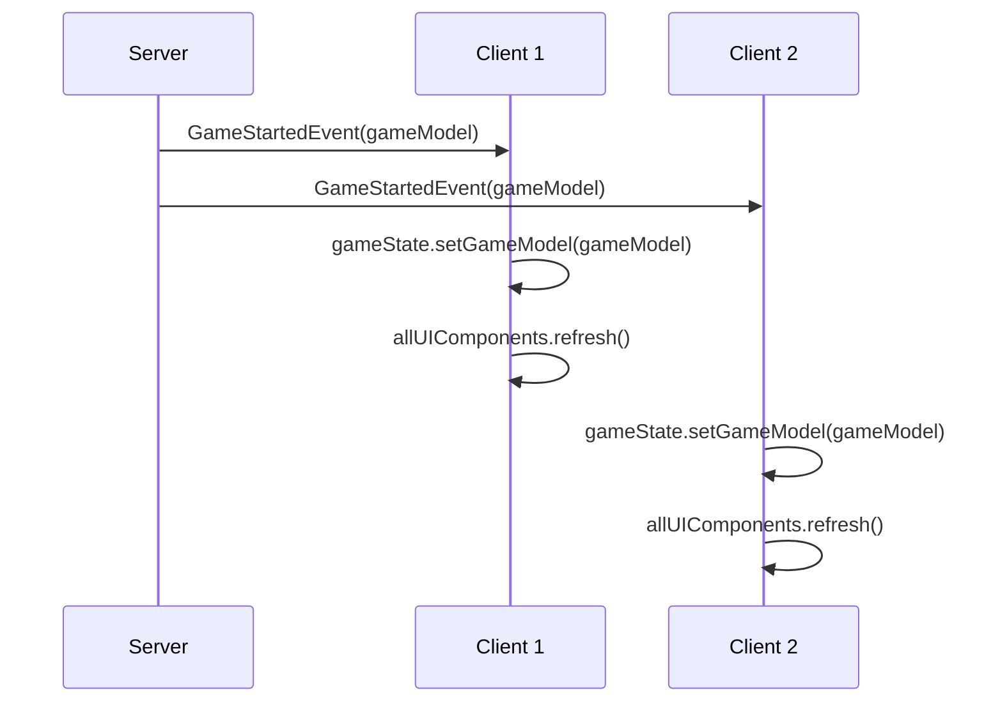

# Simple Direct Model Architecture

## Overview

A drastically simplified architecture that uses server models directly on the client, eliminates complex state management, and follows a straightforward request-response-event pattern.

## Core Principle

**Keep it simple: Use server models directly, eliminate unnecessary complexity.**

```
Request → Server Updates Model → Response to Requester + Event to Others → UI Refresh
```

That's it. No EventBus, no observers, no over-engineering.

## Architecture Comparison

### ❌ BEFORE: Complex Multi-Layer

```
┌─────────────────────────────────────────────────┐
│                 UI Layer                        │
│  • Complex property change listening           │
│  • Multiple UI update mechanisms               │
│  • Tight coupling to LocalGameState           │
└─────────────────────┬───────────────────────────┘
                      │
┌─────────────────────▼───────────────────────────┐
│            LocalGameState (691 lines)          │
│  • ComponentInstance[][] shipGrid              │
│  • Manual statistics calculation               │
│  • Complex synchronization                     │
│  • 15+ conversion methods                      │
│  • Duplicate state management                  │
└─────────────────────┬───────────────────────────┘
                      │
┌─────────────────────▼───────────────────────────┐
│            Conversion Layer                     │
│  • ComponentData → ComponentInstance           │
│  • Manual property copying                     │
│  • Error-prone mappings                        │
└─────────────────────┬───────────────────────────┘
                      │
┌─────────────────────▼───────────────────────────┐
│              Server Models                      │
│  • Ship, GameModel, Player, Component          │
└─────────────────────────────────────────────────┘
```

### ✅ AFTER: Simple Direct Usage

```
┌─────────────────────────────────────────────────┐
│                 UI Layer                        │
│  • Simple refresh() method                     │
│  • Direct server model usage via UIContext     │
│  • No complex state management                 │
└─────────────────────┬───────────────────────────┘
                      │
┌─────────────────────▼───────────────────────────┐
│               UIContext                         │
│  • ClientState (all client state)              │
│  • Dependency injection for views              │
└─────────────────────┬───────────────────────────┘
                      │
┌─────────────────────▼───────────────────────────┐
│            ClientState (~150 lines)            │
│  • Connection & auth state                     │
│  • Lobby state (games, players)               │
│  • GameModel gameModel (direct)               │
│  • Simple model replacement                   │
│  • Basic UI refresh coordination              │
└─────────────────────┬───────────────────────────┘
                      │
┌─────────────────────▼───────────────────────────┐
│              Server Models                      │
│  • Ship, GameModel, Player, Component          │
│  • Used directly on client                     │
└─────────────────────────────────────────────────┘
```

## Actor Roles

| Actor | Role | Contains | Responsibilities |
|-------|------|----------|------------------|
| **ClientState** | All client state | Connection, lobby, and game state | Store server models, connection status, coordinate UI refresh |
| **UIContext** | Dependency injection | Reference to ClientState | Provide views access to state and services |
| **Views (GUI/TUI)** | UI rendering | Nothing - just UI components | Display data, handle user input, call refresh() |
| **ViewNavigator** | View transitions | Current view state | Navigate between views (LOBBY → GAME_LOBBY → GAME) |

## Core Components

### 1. ClientState (Simple - All Client State)

**Purpose**: Single state container for all client information

```java
public class ClientState {
    // Connection & Authentication
    private ConnectionStatus connectionStatus;
    private String playerId;
    private String playerNickname;
    
    // Lobby State
    private List<GameInfo> availableGames;
    private List<PlayerInfo> playersInLobby;
    private GameInfo currentGameLobby;
    
    // Game State (null when not in game)
    private GameModel gameModel;
    
    // UI State
    private ViewState currentView;
    private UIRefreshable currentViewComponent;
    
    // Property change support for lobby/connection UI
    private PropertyChangeSupport pcs = new PropertyChangeSupport(this);
    
    // === Connection Management ===
    public void setConnectionStatus(ConnectionStatus status) {
        ConnectionStatus old = this.connectionStatus;
        this.connectionStatus = status;
        pcs.firePropertyChange("connectionStatus", old, status);
    }
    
    public void setPlayerInfo(String playerId, String nickname) {
        this.playerId = playerId;
        this.playerNickname = nickname;
        pcs.firePropertyChange("playerInfo", null, Map.of("id", playerId, "nickname", nickname));
    }
    
    // === Lobby Management ===
    public void setAvailableGames(List<GameInfo> games) {
        this.availableGames = games;
        pcs.firePropertyChange("availableGames", null, games);
    }
    
    public void setCurrentGameLobby(GameInfo gameInfo) {
        this.currentGameLobby = gameInfo;
        pcs.firePropertyChange("currentGameLobby", null, gameInfo);
    }
    
    // === Game State Management ===
    public void setGameModel(GameModel newGameModel) {
        this.gameModel = newGameModel;
        refreshCurrentView(); // Refresh game views
    }
    
    public void updatePlayer(Player updatedPlayer) {
        if (gameModel != null) {
            // Replace player in local model
            for (int i = 0; i < gameModel.getPlayers().size(); i++) {
                Player localPlayer = gameModel.getPlayers().get(i);
                if (localPlayer.getId().equals(updatedPlayer.getId())) {
                    gameModel.getPlayers().set(i, updatedPlayer);
                    break;
                }
            }
            refreshCurrentView();
        }
    }
    
    // === UI View Management ===
    public void setCurrentView(ViewState viewState, UIRefreshable viewComponent) {
        ViewState oldView = this.currentView;
        this.currentView = viewState;
        this.currentViewComponent = viewComponent;
        pcs.firePropertyChange("currentView", oldView, viewState);
    }
    
    // === Direct Model Access (Game) ===
    public Ship getLocalPlayerShip() {
        return gameModel != null ? gameModel.getPlayerById(playerId).getShip() : null;
    }
    
    public ComponentDeck getComponentDeck() {
        return gameModel != null ? gameModel.getComponentDeck() : null;
    }
    
    public GamePhase getCurrentPhase() {
        return gameModel != null ? gameModel.getCurrentPhase() : GamePhase.SETUP;
    }
    
    // === Direct Model Access (Lobby) ===
    public boolean isConnected() {
        return connectionStatus == ConnectionStatus.CONNECTED;
    }
    
    public boolean isInGame() {
        return gameModel != null;
    }
    
    // === Efficient UI Updates ===
    private void refreshCurrentView() {
        if (currentViewComponent != null) {
            Platform.runLater(() -> currentViewComponent.refresh());
        }
    }
    
    // Property change listener support for lobby/connection UI
    public void addPropertyChangeListener(PropertyChangeListener listener) {
        pcs.addPropertyChangeListener(listener);
    }
}
```

### 2. Request-Response-Event Flow (CommandDispatcher)

#### Request Processing (Self-Executing Commands)
```java
public class PlaceTileRequest extends AbstractRequest {
    private final String gameId;
    private final String componentId;
    private final Position position;
    private final Direction direction;
    
    @Override
    public Response execute(RequestContext context) {
        try {
            // 1. Get domain objects via context
            GameSession session = context.getSessionManager().getSession(gameId);
            GameModel gameModel = session.getGameModel();
            Player player = gameModel.getPlayerById(context.getPlayerId());
            Component component = findComponent(gameModel, componentId);
            
            // 2. Update server model (pure domain operation)
            component.setDirection(direction);
            player.getShip().addComponent(component, position);
            
            // 3. Create response with full server models
            PlaceTileResponse response = new PlaceTileResponse(
                getCorrelationId(),
                true,
                "Component placed successfully", 
                player.getShip(),           // Full Ship model
                gameModel.getComponentDeck() // Full ComponentDeck model
            );
            
            // 4. Publish event to other players via context
            ComponentPlacedEvent event = new ComponentPlacedEvent(
                gameId,
                player,                    // Full Player model
                component,                 // Full Component model
                player.getShip(),          // Updated Ship model  
                gameModel.getComponentDeck() // Updated ComponentDeck model
            );
            context.publishEvent(event);
            
            return response;
            
        } catch (Exception e) {
            return createErrorResponse(e.getMessage());
        }
    }
}
```

#### CommandDispatcher Flow
```java
// 1. Client sends request
networkClient.sendRequest(new PlaceTileRequest(gameId, componentId, position));

// 2. Server receives and dispatches
commandDispatcher.dispatch(request, networkClientId);

// 3. Request executes itself asynchronously
executorService.submit(() -> {
    RequestContext context = createContext(networkClientId);
    Response response = request.execute(context); // Self-execution!
    networkManager.sendResponse(response, networkClientId);
});

// 4. Events published automatically
eventPublisher.publishToOthersInGame(event, gameId, requesterId);
```

#### Response Handling (Requester)
```java
public void handleOnClient(ClientContext context) {
    if (success) {
        // Simple: replace local models with server versions
        context.getGameState().updateLocalPlayerShip(updatedShip);
        context.getGameState().updateComponentDeck(updatedDeck);
        // UI refreshes automatically
    }
}
```

#### Event Handling (Others)
```java
public void handleOnClient(ClientEventContext context) {
    // Simple: update other player's state
    context.getGameState().updatePlayer(player);
    // UI refreshes automatically
}
```

### 3. Simple UI Components

```java
public class ShipGridView implements UIRefreshable {
    private final ClientGameState gameState;
    
    public ShipGridView(ClientGameState gameState) {
        this.gameState = gameState;
        gameState.registerUIComponent(this); // Simple registration
    }
    
    @Override
    public void refresh() {
        Ship ship = gameState.getLocalPlayerShip();
        if (ship == null) return;
        
        // Direct server model usage - no conversion!
        for (int row = 0; row < ship.getRows(); row++) {
            for (int col = 0; col < ship.getCols(); col++) {
                Component component = ship.getComponentAt(row, col);
                updateGridCell(row, col, component);
            }
        }
        
        // Server calculates stats automatically
        ShipStats stats = ship.updateStats();
        updateStatsDisplay(stats);
    }
}
```

## Message Design

### Enhanced Events with Server Models

All events carry full server models instead of DTOs:

```java
// OLD: ComponentTakenEvent
public class ComponentTakenEvent extends AbstractEvent {
    private final ComponentData componentData; // DTO
    private final String playerId;             // Just ID
    
    @Override
    public void handleOnClient(ClientEventContext context) {
        // Complex conversion required
        ComponentInstance component = new ComponentInstance(
            componentData.getId(), componentData.getType(), componentData.getConnectors()
        );
        // Manual state updates
        // Manual UI notifications
    }
}

// NEW: ComponentTakenEvent  
public class ComponentTakenEvent extends AbstractEvent {
    private final Component component;      // Direct server model
    private final Player player;           // Full Player model
    private final ComponentDeck updatedDeck; // Full deck state
    
    @Override
    public void handleOnClient(ClientEventContext context) {
        // Simple: direct model update
        context.getGameState().updatePlayer(player);
        context.getGameState().updateComponentDeck(updatedDeck);
        // UI refreshes automatically
    }
}
```

### Enhanced Responses with Server Models

```java
public class PlaceTileResponse extends AbstractResponse {
    private final boolean success;
    private final String message;
    private final Ship updatedShip;        // Full ship state
    private final ComponentDeck updatedDeck; // Full deck state
    
    @Override
    public void handleOnClient(ClientContext context) {
        if (success) {
            // Simple model replacement
            context.getGameState().updateLocalPlayerShip(updatedShip);
            context.getGameState().updateComponentDeck(updatedDeck);
        }
    }
}
```

## Complete Flow Examples

### Example 1: Component Placement



### Example 2: Game Start



## Efficient View Updates

**Only Current View Refreshed:**
```java
// ViewNavigator tells ClientGameState which view is active
public void navigateToShipBuilding() {
    UIView shipBuildingView = createShipBuildingView();
    shipBuildingView.show();
    
    // ✅ Only this view will be refreshed on server updates
    context.getGameState().setCurrentView((UIRefreshable) shipBuildingView);
}

// Server updates only refresh visible view
public void updateFromServer(GameModel newGameModel) {
    this.gameModel = newGameModel;
    refreshCurrentView(); // ✅ Only current view, not all views
}
```

## Implementation Benefits

### ✅ Dramatic Simplification

- **~600 lines of code eliminated** (LocalGameState complexity)
- **15+ conversion points removed** (DTO mappings)
- **Zero duplicate state management**
- **No complex synchronization patterns**
- **Efficient updates** - Only visible view refreshed

### ✅ Better Performance

- **Faster updates** - no conversion overhead
- **Lower memory usage** - single model representation
- **Automatic calculations** - server model methods used directly
- **Simple UI refresh** - no complex property change events

### ✅ Easier Development

- **Direct model usage** - ship.getComponentAt(position)
- **Type safety** - compiler ensures compatibility
- **Simple debugging** - single representation, clear flow
- **Less code to maintain** - eliminate conversion layers

### ✅ Preserved Architecture Quality

- **Clean separation** - server models remain pure
- **Self-handling events** - existing pattern preserved
- **Request-response** - familiar pattern enhanced
- **No architectural violations** - still follows clean architecture

## Detailed Implementation Plan

### Phase 1: Core State Management (Week 1)

#### 1.1 Create ClientState Class
**File**: `src/main/java/it/polimi/ingsw/client/core/ClientState.java` (NEW)
- Replace `LocalGameState` singleton with simple dependency-injected class
- Store `GameModel gameModel` directly from server
- Add simple lobby state management
- Include basic UI refresh mechanism

```java
public class ClientState {
    // Connection & Authentication
    private ConnectionStatus connectionStatus;
    private String playerId;
    private String playerNickname;
    
    // Lobby State
    private List<GameInfo> availableGames;
    private List<PlayerInfo> playersInLobby;
    private GameInfo currentGameLobby;
    
    // Game State (null when not in game)
    private GameModel gameModel;  // Direct server model!
    
    // UI State
    private ViewState currentView;
    private UIRefreshable currentViewComponent;
}
```

#### 1.2 Create UIContext for Dependency Injection
**File**: `src/main/java/it/polimi/ingsw/client/ui/UIContext.java` (NEW)
- Provide access to `ClientState` for all UI components
- Replace current `AbstractUIContext` pattern
- Simple service locator pattern

#### 1.3 Remove LocalGameState
**File**: `src/main/java/it/polimi/ingsw/client/core/state/LocalGameState.java` (DELETE)
- 691 lines of complex state management eliminated
- All `LocalGameState.getInstance()` calls need replacement

### Phase 2: Update Event System (Week 1-2)

#### 2.1 Update GameStartedEvent
**File**: `src/main/java/it/polimi/ingsw/common/message/event/GameStartedEvent.java`
**Changes**:
- Replace complex initialization with simple: `clientState.setGameModel(gameModel)`
- Remove all ComponentInstance conversion logic (lines 89-121)
- Eliminate PropertyChangeSupport calls

**Before**:
```java
// Complex conversion from server Component to ComponentInstance
ComponentInstance component = new ComponentInstance(
    serverComponent.getId(),
    serverComponent.getType(), 
    serverComponent.getConnectors()
);
```

**After**:
```java
// Simple direct model usage
clientState.setGameModel(gameModel);
```

#### 2.2 Update ComponentTakenEvent  
**File**: `src/main/java/it/polimi/ingsw/common/message/event/ComponentTakenEvent.java`
**Changes**:
- Add full server models: `Player player`, `ComponentDeck updatedDeck`
- Replace LocalGameState calls with `clientState.updatePlayer(player)`
- Remove ComponentInstance conversion (lines 42-50)

#### 2.3 Update All Other Events
**Pattern**: Replace DTO-based payloads with full server models
**Files to Update**:
- `BuildingPhaseStartedEvent.java` (NEW) - Carry full `GameModel`
- `FlightPhaseStartedEvent.java` (NEW) - Carry full `GameModel` 
- `TilePlacedEvent` → `ComponentPlacedEvent` - Carry `Player`, `Ship`, `ComponentDeck`
- `TileReservedEvent` → `ComponentReservedEvent` - Carry `Player`, `ComponentDeck`

### Phase 3: Update Request-Response System (Week 2)

#### 3.1 Update Request Execution Pattern
**File**: `src/main/java/it/polimi/ingsw/common/message/request/PlaceTileRequest.java`
**Changes**:
- Keep current self-executing pattern
- Update response payload to include full server models

**Before Response**:
```java
PlaceTileResponse response = new PlaceTileResponse(
    getCorrelationId(),
    true,
    "Component placed successfully"
);
```

**After Response**:
```java  
PlaceTileResponse response = new PlaceTileResponse(
    getCorrelationId(),
    true,
    "Component placed successfully",
    player.getShip(),           // Full Ship model
    gameModel.getComponentDeck() // Full ComponentDeck model
);
```

#### 3.2 Update Response Handling
**File**: `src/main/java/it/polimi/ingsw/common/message/response/PlaceTileResponse.java`
**Changes**:
- Add server model fields: `Ship updatedShip`, `ComponentDeck updatedDeck`
- Simplify `handleOnClient()` to direct model updates
- Remove PropertyChangeSupport complexity

#### 3.3 Update All Request/Response Pairs
**Files to Update**:
- `PlaceTileRequest.java` / `PlaceTileResponse.java`
- `TakeTileRequest.java` / `TakeTileResponse.java` 
- `ReserveTileRequest.java` / `ReserveTileResponse.java` (NEW)
- `ValidateShipRequest.java` / `ValidateShipResponse.java`

### Phase 4: Update UI Components (Week 2-3)

#### 4.1 Update ShipGridView
**File**: `src/main/java/it/polimi/ingsw/client/ui/gui/components/ShipGridView.java`
**Major Changes**:
- Remove dependency on `LocalGameState.getInstance()`
- Accept `UIContext` in constructor for dependency injection
- Use `clientState.getGameModel().getPlayerById(playerId).getShip()` directly
- Replace `ComponentInstance` with server `Component` model
- Implement simple `refresh()` method

**Before**:
```java
LocalGameState gameState = LocalGameState.getInstance();
ComponentInstance[][] grid = gameState.getShipGrid();
```

**After**:
```java
Ship ship = uiContext.getClientState().getLocalPlayerShip();
Component component = ship.getComponentAt(row, col);
```

#### 4.2 Update GuiShipBuildingView
**File**: `src/main/java/it/polimi/ingsw/client/ui/gui/views/GuiShipBuildingView.java`
**Major Changes**:
- Remove `PropertyChangeListener` setup (lines 92)
- Replace `batchUpdateAllDisplays()` with simple `refresh()` calls
- Remove complex `updatesPending` and `updateLock` mechanisms
- Direct server model usage throughout

**Before**:
```java
private void setupPropertyChangeListeners() {
    LocalGameState gameState = LocalGameState.getInstance();
    gameState.addPropertyChangeListener("shipGrid", this::handleShipGridUpdate);
    // ... complex listener setup
}
```

**After**:
```java
public void refresh() {
    Ship ship = uiContext.getClientState().getLocalPlayerShip();
    shipGridView.updateFromShip(ship);
    enhancedHandView.updateFromDeck(uiContext.getClientState().getComponentDeck());
}
```

#### 4.3 Update Component UI Views
**Files to Update**:
- `ShipGridView.java` - Use direct server `Component` instead of `ComponentInstance`
- `EnhancedHandView.java` - Use `ComponentDeck` directly
- `ComponentJunkyardView.java` - Use `ComponentDeck.getJunkyard()` directly  
- `PlayerMiniView.java` - Use server `Player` model directly

#### 4.4 Remove ComponentInstance Class
**File**: `src/main/java/it/polimi/ingsw/client/core/state/ComponentInstance.java` (DELETE)
- Remove client-side duplicate of server Component logic
- All references replaced with server `Component` class

### Phase 5: Update ClientController (Week 3)

#### 5.1 Simplify Message Handling
**File**: `src/main/java/it/polimi/ingsw/client/controller/ClientController.java`
**Changes**:
- Update constructor to accept `ClientState` instead of `ClientModel`
- Simplify `MessageHandler` inner class
- Remove complex PropertyChangeSupport integration
- Direct `clientState` updates in message handlers

**Before**:
```java
private final ClientModel model;
// Complex PropertyChangeSupport coordination
```

**After**:
```java
private final ClientState clientState;
// Simple direct state updates
```

#### 5.2 Update ClientModel
**File**: `src/main/java/it/polimi/ingsw/client/ClientModel.java`
**Decision**: KEEP for lobby/connection state, REMOVE game state management
- Keep connection status, server info, view navigation
- Remove all game-related PropertyChangeSupport
- Remove complex state synchronization

### Phase 6: Update View Navigation (Week 3)

#### 6.1 Update ViewNavigator
**File**: Current view navigation files
**Changes**:
- Update to use `UIContext` dependency injection
- Register current view with `ClientState` for efficient updates
- Remove complex view coordination

#### 6.2 Update TUI Components  
**File**: `src/main/java/it/polimi/ingsw/client/ui/tui/views/TuiShipBuildingView.java`
**Changes**: 
- Same pattern as GUI components
- Use direct server models
- Simple refresh mechanism

### Phase 7: Performance Optimizations (Week 4)

#### 7.1 Efficient UI Updates
**Implementation**:
- Only refresh currently visible view
- No batch update complexity
- Simple model replacement triggers refresh

#### 7.2 Remove Legacy Infrastructure
**Files to DELETE**:
- `LocalGameState.java` (691 lines)
- `ComponentInstance.java` 
- Complex PropertyChangeSupport patterns
- DTO conversion utilities

**Files to SIMPLIFY**:
- All event handlers (remove conversion logic)
- All UI components (direct model usage)
- ClientController (simplified message handling)

### Phase 8: Testing & Validation (Week 4)

#### 8.1 Integration Testing
- Test all game flows with new architecture
- Verify UI responsiveness with direct model usage
- Performance testing vs. old architecture

#### 8.2 Validation
- Ensure no regressions in game functionality
- Verify memory usage improvements
- Confirm development experience improvements

## Files Impact Summary

### Files to DELETE (Complexity Elimination)
1. `LocalGameState.java` - 691 lines eliminated
2. `ComponentInstance.java` - Client-side duplication removed
3. Various DTO conversion utilities

### Files to CREATE (Simple Replacements)
1. `ClientState.java` - Simple state container (~150 lines)
2. `UIContext.java` - Dependency injection (~50 lines)
3. New event types with server models

### Files to HEAVILY MODIFY (Simplification)
1. `GuiShipBuildingView.java` - Remove complex property listeners
2. `ClientController.java` - Simplify message handling
3. All UI component files - Direct server model usage
4. All event handler files - Remove conversion logic

### Files to LIGHTLY MODIFY (Server Model Integration)
1. All request/response files - Add server model payloads
2. Network layer files - Minimal changes
3. Server-side files - Minimal changes for enhanced responses

## Expected Benefits

### Complexity Reduction
- **~600 lines eliminated** from LocalGameState complexity
- **15+ conversion points removed** (DTO mappings)
- **Zero duplicate state management**
- **Simplified UI update mechanism**

### Performance Improvements  
- **Faster updates** - No conversion overhead
- **Lower memory usage** - Single model representation
- **Efficient UI refresh** - Only visible view updated

### Development Experience
- **Direct model usage** - `ship.getComponentAt(position)`
- **Type safety** - Compiler-enforced compatibility
- **Easier debugging** - Single representation, clear flow
- **Less maintenance** - Eliminated conversion layers

## Migration Timeline

| Week | Focus | Deliverables |
|------|-------|--------------|
| 1 | Core State + Events | ClientState class, Updated events with server models |
| 2 | UI Components | Updated UI to use direct models, Removed ComponentInstance |
| 3 | Request/Response + Controller | Enhanced responses, Simplified ClientController |
| 4 | Testing + Cleanup | Integration testing, Performance validation, Documentation |

This migration transforms the codebase from a complex, over-engineered state management system into a simple, direct model usage pattern that maintains all functionality while dramatically reducing complexity.

## Key Differences from Complex Version

### ❌ Removed Complexity
- No EventBus coordination
- No observer patterns
- No complex state synchronization  
- No ComponentDisplayAdapter
- No application service layer
- No event batching/sequencing

### ✅ Kept Simple
- Direct server model usage
- Simple UI refresh mechanism
- Straightforward request-response pattern
- Basic event broadcasting
- Lightweight client state management

## Conclusion

This architecture achieves the same benefits (eliminate DTO conversions, use server models directly, simplify client state) but with **much less complexity**. 

It follows the principle: **Use the simplest solution that works.**

- ✅ **Simple to understand** - clear request-response-event flow
- ✅ **Simple to implement** - builds on existing patterns
- ✅ **Simple to maintain** - fewer moving parts
- ✅ **Simple to debug** - direct model usage, clear flow

The result is a clean, maintainable architecture that eliminates unnecessary complexity while achieving all the desired simplification goals.