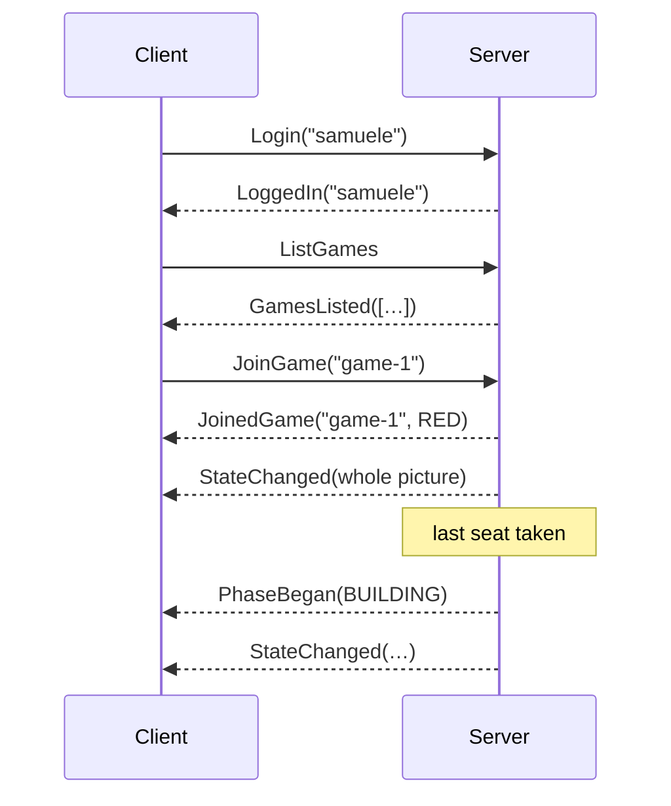
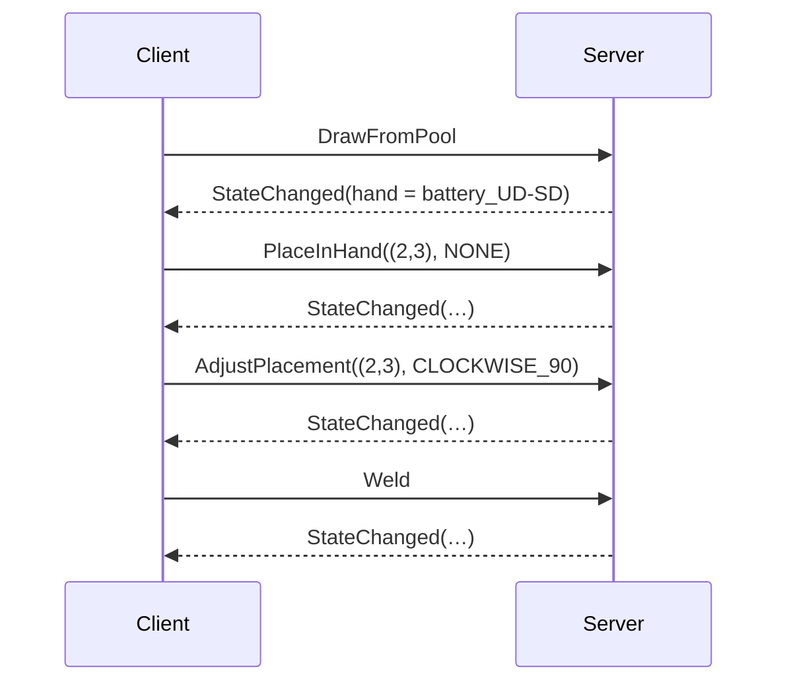
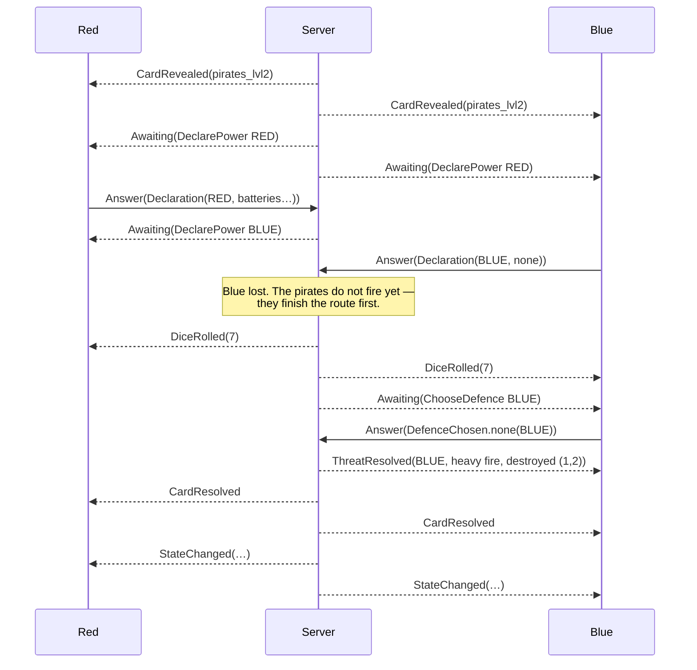

# The protocol

Everything the client and the server say to each other, and the rules that make it safe.

The messages are Java records under [`it.polimi.ingsw.common.protocol`](../../src/main/java/it/polimi/ingsw/common/protocol).
This document explains what they mean and when they travel; the records themselves are the
authority on their fields. Both are changed in the same pull request, always — a protocol
document written afterwards is a protocol document that is wrong.

---

## 1. Shape

Client to server is a closed set of **commands**. Server to client is a closed set of
**events**. Neither side ever calls a method on the other: RMI is a way of moving these
messages, not a way of reaching into the model from another machine.

Both sets are sealed in two layers.

```
Command                                  Event
├── LobbyCommand        5 messages       ├── LobbyEvent      5 messages
├── BuildingCommand    12 messages       ├── GameEvent       5 messages
├── PreparationCommand  4 messages       └── FlightEvent     7 messages
└── FlightCommand       2 messages
```

The families match the phases of a game. That is what makes "each phase decides which
commands are legal" a fact the compiler knows rather than a convention somebody has to
remember: a phase switches over the family it owns and is told at compile time when a
message is added to it.

---

## 2. Four rules

### 2.1 Nobody says who they are

No command carries a nickname or a colour. The server knows which session a message arrived
on and looks up the player from that.

There is one exception and it is not really one. `PlayerChoice` names the player it came
from, because the model needed that before there was a network. Over a socket that name is a
claim anybody can make, so the server **checks it against the session** and refuses a
mismatch. Without that check, one player could throw another's crew out of the airlock by
sending a `CrewGiven` with somebody else's colour on it.

### 2.2 Facts, then truth

Events come in batches. Everything in a batch says what *happened* — the dice came up seven,
the red ship lost a cabin, a card was turned over — and the batch ends with one
`GameEvent.StateChanged` carrying the whole picture.

A client that ignores every narration event and reads only `StateChanged` is **still
correct**. It will have nothing interesting to say, but its board will never be wrong.

This is worth more than it looks:

- Nothing is ever expressed *only* as a delta, so a client cannot drift out of step by
  missing a message.
- Reconnecting is the same operation as joining. Send the state. There is no replay log, no
  sequence numbering and no resynchronisation handshake — none of which can go wrong if none
  of them exists.
- A test client can be written in an afternoon.

### 2.3 Nothing on the wire is an `Optional`

RMI marshals with Java serialization, and `java.util.Optional` is deliberately not
serializable. A message carrying one compiles, passes unit tests, works over a socket, and
fails the first time two people play over RMI.

So a value that may be absent is `null`, and is read through an `…IfAny()` accessor:

```java
prompt.targetIfAny().ifPresent(view::highlight);
```

This is enforced, not remembered. `ProtocolContractTest` walks every record component of both
sealed hierarchies and fails the build on an `Optional`, or on anything else Java
serialization cannot carry.

### 2.4 No domain object crosses

The client never receives a `Ship`. It receives a [`ShipView`](../../src/main/java/it/polimi/ingsw/common/protocol/view/ShipView.java):
an immutable record holding what a view needs to draw and nothing that would let a client
answer a question the server is supposed to answer.

The value types **are** shared — a `Position` is a `Position` on both sides, and duplicating
twelve enums to avoid saying so would buy nothing but twelve pairs that can drift apart. The
line is drawn at authority, not at code sharing: see [architecture § 2](../architecture/overview.md).

---

## 3. Commands

### 3.1 `LobbyCommand` — getting to a table

| Message | Fields | When | Answered with |
|:--|:--|:--|:--|
| `Login` | `nickname` | first message on any connection | `LoggedIn`, or `Rejected` if the name is taken |
| `ListGames` | — | in the lobby | `GamesListed` |
| `CreateGame` | `level`, `seats` | in the lobby | `JoinedGame` + `StateChanged` |
| `JoinGame` | `gameId` | in the lobby | `JoinedGame` + `StateChanged`; the table gets `PlayerEntered` |
| `LeaveGame` | — | before the game starts | the table gets `PlayerLeft` |

`Login` is also how a player comes back. If the nickname belongs to somebody who dropped out
of a game still running, the server rebinds the session to that seat and answers with the
game instead of the lobby. There is no separate reconnect command, because a separate
reconnect command is a second code path that can disagree with the first.

The game starts by itself when the last seat is taken. Nobody declares it started.

**Colours are assigned, not chosen.** Letting players pick would be a second negotiation
before the game had even begun, with its own rules for what happens when two people want red.
They go out in the order people arrive.

**Refusals travel as `GameEvent.Rejected`**, in the lobby as well as in a game. It is the one
refusal message the protocol has; the family it is filed under is where a command is refused
*from*, not what kind of command was refused.

### 3.2 `BuildingCommand` — the shipyard

Everybody builds at once. There are no turns here, so these arrive interleaved from every
player and each is answered on its own.

| Message | Fields | Notes |
|:--|:--|:--|
| `DrawFromPool` | — | takes a face-down tile; what it is is not known until it is in the hand |
| `TakeFaceUp` | `tileId` | from the discard pile, which anyone may take from |
| `TakeReserved` | `tileId` | takes back one of this player's set-aside tiles |
| `ReturnToPool` | — | puts the held tile face up, where everyone can see it |
| `Reserve` | — | sets it aside; a reserved tile never welded **counts as lost** |
| `PlaceInHand` | `cell`, `rotation` | puts it down, not yet welded |
| `AdjustPlacement` | `cell`, `rotation` | move or turn it; free, and repeatable |
| `Weld` | — | commits it; after this it comes off only by being thrown away |
| `ScoutPile` | `pile` | level II: look at a card pile, while the glass runs |
| `PutPileBack` | — | stop looking |
| `FlipTimer` | — | turn the hourglass |
| `FinishBuilding` | `startSpace` | declare the ship done and take the starting line |

Three of these carry a rule worth stating in the protocol, because a client that does not
know them will build an interface that lies:

- **Placement is not validated.** `PlaceInHand` checks only that the cell is on the ship's
  outline and touching what is already built. Whether the connectors match is *not* checked:
  the manual lets a player build an illegal ship and find out during validation, and taking
  that away would be changing the game.
- **The last turn of the glass is restricted.** Anyone may `FlipTimer`, except that the final
  turn may only be made by a player who has already finished. Otherwise somebody still
  building could start the final countdown at a moment that suits them.
- **`startSpace` is `null` on the test flight**, where spaces go in the order players
  finished rather than being chosen.

### 3.3 `PreparationCommand` — repair and crew

| Message | Fields | Notes |
|:--|:--|:--|
| `RemoveComponent` | `cell` | the only way to fix an illegal ship; the component is **lost** |
| `KeepPiece` | `piece` | when a removal broke the ship apart, choose which half flies on |
| `BoardCrew` | `cabin`, `alien` | `alien` is `null` for two people |
| `FinishPreparation` | — | fills every remaining cabin with people and declares ready |

An alien may board only where a life support module of its colour is **welded to** the cabin
— welded, not merely next to it. That distinction runs through the whole model and it is the
one most often got wrong.

### 3.4 `FlightCommand` — the flight

| Message | Fields | Notes |
|:--|:--|:--|
| `Answer` | `choice` | answers the outstanding `PlayerPrompt` |
| `GiveUp` | — | leave the route, keep the credits, lose the cargo and the placing |

The flight is two commands because every card — Stardust, Pirates, the Combat Zone — is a
sequence of questions and the answers to them, and there is nothing else a flight consists
of. There is no `TakeReward` command, no `DeclareFirepower` command, and no switch anywhere
that has to grow when a card is added.

That is not a coincidence. `PlayerPrompt` and `PlayerChoice` were written as the model's
driving interface before there was a network, and turned out to already be the protocol.

---

## 4. Events

### 4.1 `LobbyEvent`

| Message | Fields | Meaning |
|:--|:--|:--|
| `LoggedIn` | `nickname` | the name is yours |
| `GamesListed` | `games` | games somebody could join; games in progress are not listed |
| `JoinedGame` | `gameId`, `colour` | you have a seat, and these are your markers |
| `PlayerEntered` | `nickname`, `colour` | somebody else sat down |
| `PlayerLeft` | `nickname` | somebody gave up their seat before the start |

### 4.2 `GameEvent`

| Message | Fields | Meaning |
|:--|:--|:--|
| `StateChanged` | `state` | the whole picture; ends every batch |
| `PhaseBegan` | `phase` | redundant with the state, and sent anyway — a phase change is the one moment a view has to restructure rather than redraw |
| `Rejected` | `command`, `reason` | your command was refused and **nothing changed**; sent only to you, never followed by a state |
| `ConnectionChanged` | `player`, `connected` | somebody dropped, or came back |
| `GameEnded` | — | nothing further will be accepted. It comes **before** the final `StateChanged`, like every other fact, and the ledger travels in that state |

`Rejected` carries a sentence, not a code. The server already knows what went wrong, and a
numeric code would only have to be turned back into this sentence by every client that ever
connects.

### 4.3 `FlightEvent`

All narration. The `StateChanged` that follows is the truth.

| Message | Fields | Meaning |
|:--|:--|:--|
| `CardRevealed` | `card` | a card was turned over |
| `Awaiting` | `prompt` | the game is waiting for a decision — sent to **everyone**, so a view can say who is thinking |
| `DiceRolled` | `total` | two dice; the sum is what the rules use |
| `ThreatResolved` | `player`, `hit`, `damage` | a shot or a meteor arrived and was dealt with |
| `ShipMoved` | `player`, `from`, `to` | absolute positions, so a lapped ship is distinguishable from one merely behind |
| `ShipRetired` | `player`, `reason` | gave up, or was pushed out; from outside the two look identical |
| `CardResolved` | — | the card is finished with |

---

## 5. How it goes

### 5.1 Joining



The `StateChanged` after `JoinedGame` is not a courtesy. It is the only thing that tells the
client what game it has joined, and it is the same message a reconnecting client gets.

### 5.2 Welding a tile



Every step answers with the whole state, which is more than a delta would cost and removes
the possibility of a hand that exists on one side and not the other. During building the
state is small: no route, no cards, no scores.

Only the player who drew the tile sees it. `BuildingView.hand` and `BuildingView.scouted` are
the two things a `GameView` holds that are not public, and the reason the view is built per
recipient rather than once for the table.

### 5.3 Resolving a card

The Pirates, three players, of whom the second loses the fight.



Two things in that exchange are the card's rules showing through the protocol, not accidents
of implementation:

- `Awaiting` goes to **both** players. A view that only knew *somebody* was thinking could
  not say who, and a game that appears to hang is indistinguishable from one that has.
- The dice are rolled **once**, after the whole route has been fought, and the same roll is
  used against every ship the pirates beat. Rolling per victim would be a much gentler card.

### 5.4 Dropping and coming back

```mermaid
sequenceDiagram
    participant C as Client
    participant S as Server
    participant O as Others
    Note over C,S: connection lost
    S-->>O: ConnectionChanged(RED, false)
    Note over S: the game carries on;<br/>Red's turns are skipped
    C->>S: Login("samuele")
    S-->>C: LoggedIn("samuele")
    S-->>C: JoinedGame("game-1", RED)
    S-->>C: StateChanged(whole picture)
    S-->>O: ConnectionChanged(RED, true)
```

There is nothing else. No replay, no catch-up stream, no missed-message negotiation. That is
the whole return on rule 2.2: because the state is sent in full at the end of every batch,
sending it once more is a complete recovery.

---

## 6. Keeping this true

`ProtocolContractTest` holds the protocol to four things:

1. **Every message has a worked example** in `Messages`, checked against the sealed
   hierarchies. A record added without a sample fails the build.
2. **Every message is marshallable** — the record components of the whole hierarchy are
   walked, and anything Java serialization cannot carry fails, `Optional` by name.
3. **Every message round-trips**, on real instances, including a fully populated `GameView`.
4. **Every message is a record**, so a message cannot grow behaviour and start deciding
   things.

The walker itself is checked for doing its job, because a hierarchy walk that quietly
returned nothing would make all four pass while checking nothing at all.
