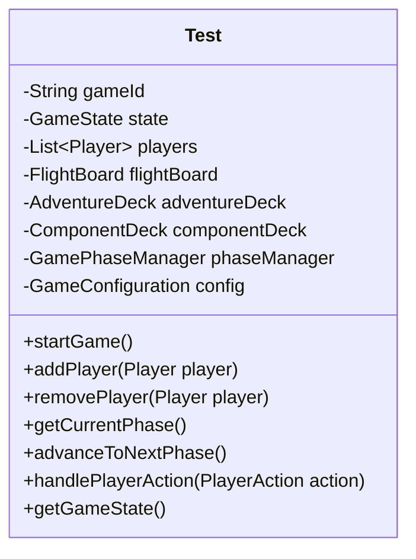

<!-- Add mermaid plugin in IntelliJ to visualize the class diagram -->
# v1 - Class Diagram

### Main features and classes

```java
import javafx.application.Application;

class Test implements Application {
    //code
}
```
